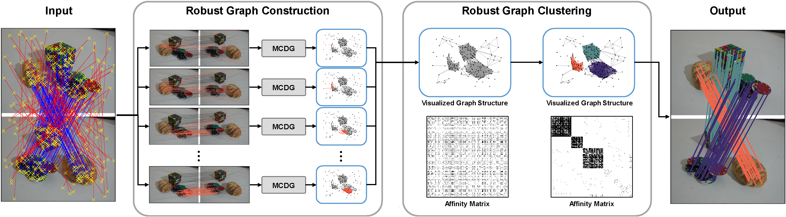

# GCLAC
**Official MATLAB implementation of the IJCV paper:** **[Feature Matching via Graph Clustering with Local Affine Consensus](https://link.springer.com/article/10.1007/s11263-024-02291-5)**

## Summary
GCLAC is a novel framework for feature matching, treating each putative match as a node and encoding geometric relationships into edges. This allows us to leverage graph clustering to solve feature matching tasks. The implementation includes robust graph construction using local affine strategies and efficient and robust graph clustering algorithms.



## Function `GCLAC`
The `GCLAC` function integrates key components of the framework:
1. **Graph Construction**: Encodes putative matches as nodes and uses local affine consensus to construct geometrically meaningful edges.
2. **MCDG Solver**: Extracts motion-coherent local geometric information to create sparse and transformation-agnostic graphs.
3. **Graph Clustering (D2SCAN)**: Applies replicator dynamics optimization to identify strongly connected subgraphs, enabling robust and efficient feature matching.

### Inputs
- **X**: Matrix of feature points from image 1.
- **Y**: Matrix of feature points from image 2.
- **nc**: Controls the size of grid division.
- **sigma**: Controls the sensitivity of the geometric consistency score on deformations.
- **epsilon**: Bandwidth of the Gaussian kernel
for distance decay.
- **inlier_threshold**: Inlier-outlier threshold.

### Outputs
- **inliers**: Indices of inlier matches.
- **clusters**: Cluster assignments for matched features.
- **W**: Weighted adjacency matrix of the constructed graph.

---

## Usage
1. Clone this repository and add the `src` directory to your MATLAB path:
   ```matlab
   addpath(genpath('src'));
   ```

2. Run the demonstration script:
    ```matlab
   run demo.m;
   ```

## Dependencies
No external dependencies are required. Ensure that MATLAB is properly installed.

## Citation
If you use GCLAC in your research, please cite the following paper:
```bibtex
@article{lu2024feature,
  title     = {Feature Matching via Graph Clustering with Local Affine Consensus},
  author    = {Lu, Yifan and Ma, Jiayi},
  journal   = {International Journal of Computer Vision},
  pages     = {1--28},
  year      = {2024},
  publisher = {Springer}
}
```

## License
This project is licensed under the MIT License. See the ``LICENSE`` file for details.